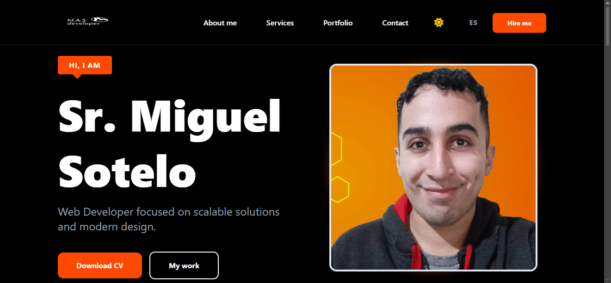
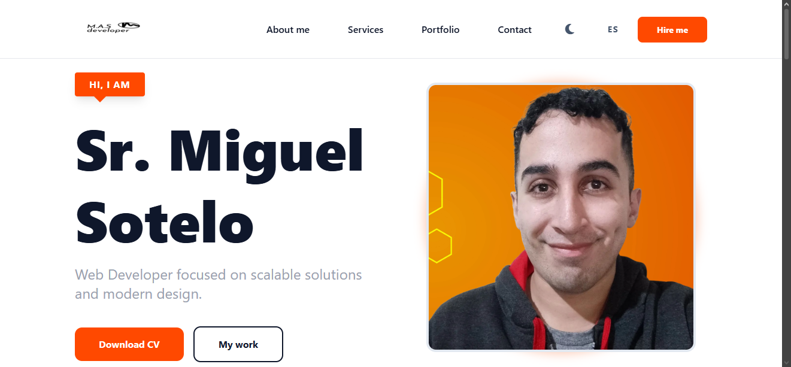
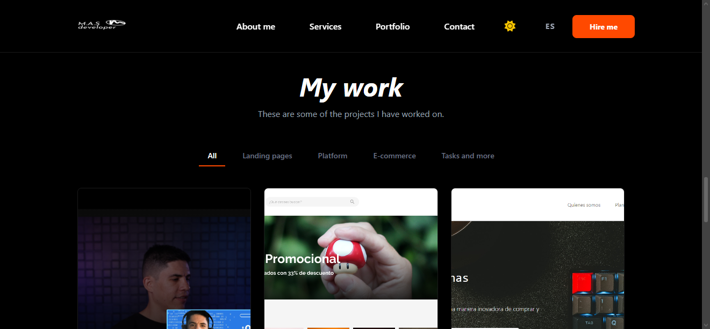

# Portfolio Profesional v2.0 - Miguel Sotelo

Este proyecto es mi portafolio profesional, mejorando el diseño vanilla asi como con un enfoque en la escalabilidad, el rendimiento y la experiencia de usuario (UX).

## 🚀 Demo En Vivo
[Ver Portafolio Online](https://portfolio-miguel-sotelo.vercel.app)

---
## 📸 Visual Review

### Interfaz Adaptativa (Light & Dark Mode)
| Modo Oscuro | Modo Claro |
| :---: | :---: |
|  |  |

### Portafolio & Experiencia de Usuario

  
   
  <em>Grilla de proyectos con filtrado dinámico y diseño responsivo.</em>

## 🛠️ Stack Tecnológico
* **Frontend:** React.js con Vite.
* **Estilos:** Tailwind CSS v4 para un diseño moderno y minimalista.
* **Internacionalización:** i18next para soporte multilingüe (ES/EN).
* **Gestión de Estado:** Hooks de React (useState, useEffect).

## ✨ Características Principales
* **Multilingüe:** Traducción dinámica completa.
* **Modo Oscuro/Claro:** Implementación de temas con persistencia mediante `localStorage`.
* **Diseño Responsivo:** Optimizado para dispositivos móviles, tablets y escritorio.
* **Arquitectura Limpia:** Código indentado bajo estándares de Prettier y separado por componentes reutilizables.

## 👨‍💻 Perfil Académico
Actualmente soy estudiante de **Ingeniería en Sistemas de Información** en la **Universidad Tecnológica Nacional (UTN FRT)**. Este portafolio refleja mi capacidad para integrar lógica de negocio compleja con interfaces de usuario pulidas, asi como un lugar donde realmente porder poner mi trabajo.

## ⚙️ Instalación Local
Si querés probar este proyecto localmente:

1. Cloná el repositorio:
   `git clone https://github.com/miguelsotelo01/Portfolio-MiguelSotelo.git`
2. Instalá las dependencias:
   `npm install`
3. Iniciá el servidor de desarrollo:
   `npm run dev`

---

Desarrollado con ❤️ por Miguel Sotelo.
